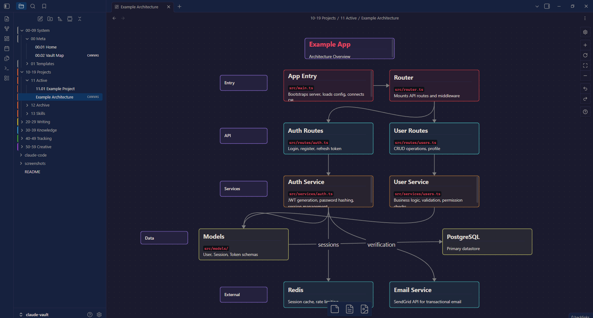
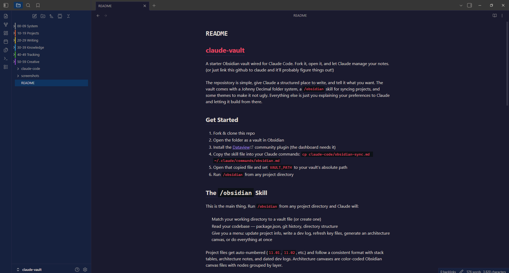
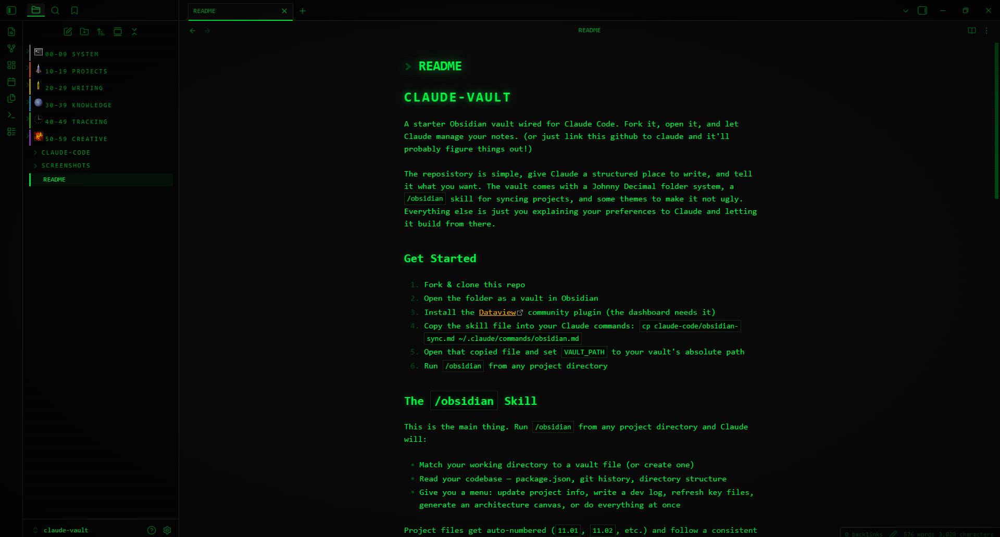
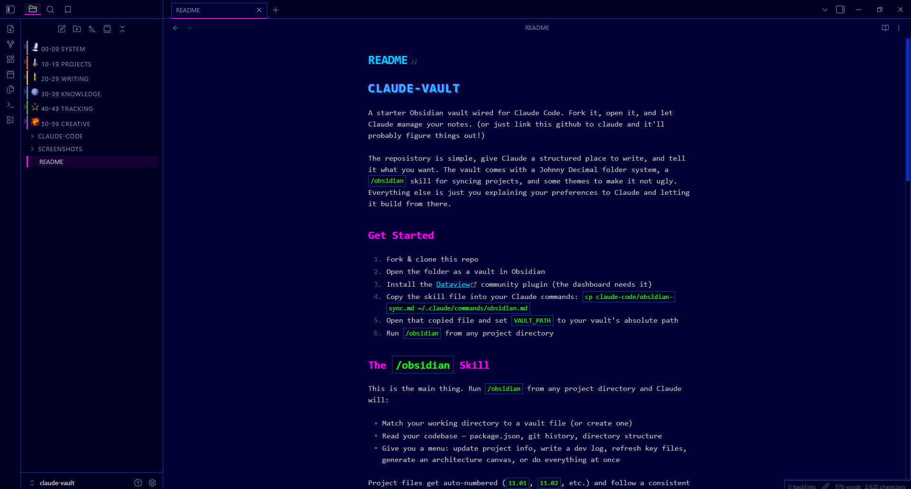
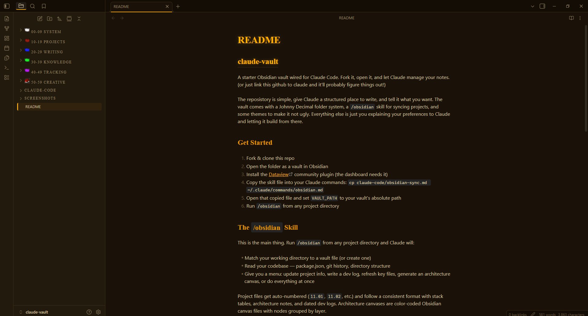
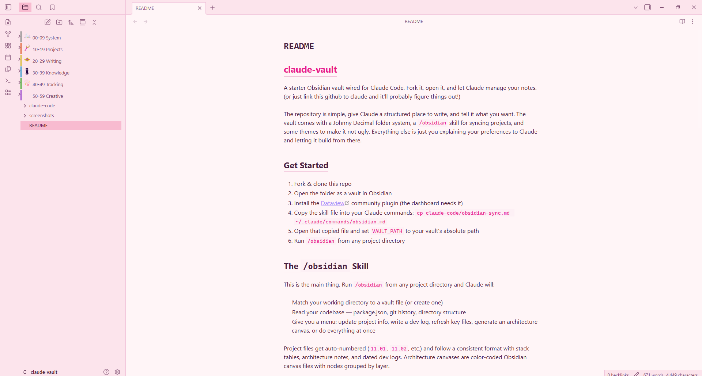

# claude-obsidian-assistant

A starter Obsidian vault wired for Claude Code. Fork it, open it, and let Claude manage your notes. (or just link the github to claude and it'll help you figure things out!)


*My custom workspace in Obsidian.*

The repository is simple, give Claude and yourself a structured place to write, and tell it what you want. The vault comes with a Johnny Decimal folder system, a `/obsidian` skill for syncing projects, and some themes to make it more fun. There's also a `CLAUDE.md` at the root that gives Claude context on how the vault works. **It's a template meant to be adjusted after setup**, but it helps initialize Claude with some understanding of the structure faster. You can go in without it and probably be fine. Everything else is just you explaining your preferences to Claude and letting it build from there.

## Get Started

If you don't have Obsidian yet, grab it at [obsidian.md](https://obsidian.md/), it's free for personal use.

1. Fork & clone this repo
2. Open the folder as a vault in Obsidian
3. Copy the skill file into your Claude commands: `cp claude-code/obsidian-sync.md ~/.claude/commands/obsidian.md`
4. Open that copied file and set `VAULT_PATH` to your vault's absolute path
5. Run `/obsidian` from any project directory
6. *(Optional)* Install [Dataview](https://github.com/blacksmithgu/obsidian-dataview) — only the home dashboard (`00.01 Home`) relies on it, but it's a great community plugin to have. To install: Settings → Community Plugins → Turn on community plugins → Browse → search "Dataview" → Install → Enable.

## The `/obsidian` Skill

This is the main thing. Run `/obsidian` from any project directory and Claude will:

- Match your working directory to a vault file (or create one)
- Read your codebase — package.json, git history, directory structure
- Give you a menu: update project info, write a dev log, refresh key files, generate an architecture canvas, or do everything at once

Project files get auto-numbered (`11.01`, `11.02`, etc.) and follow a consistent format with stack tables, architecture notes, and dated dev logs. Architecture canvases are color-coded Obsidian canvas files with nodes grouped by layer.

The skill file is `claude-code/obsidian-sync.md` - make sure to read through it to see exactly what each phase does **AND PLEASE MAKE ADJUSTMENTS TO FIT YOUR OWN NEEDS/WANTS**. The architecture canvas JSON format is documented in `claude-code/canvas-reference.md`. (This may not be needed but it can help Claude understand general canvas file structures quicker.)

### Example

The vault documents itself. `10-19 Projects/11 Active/11.02 Claude Obsidian Assistant.md` was generated by running `/obsidian` from this repo — it includes the stack table, sync flow architecture, key files, and a dev log entry for the initial release. The matching architecture canvas is at `10-19 Projects/11 Active/Claude Obsidian Assistant Architecture.canvas`.

### Architecture Canvases

One of the skill's options generates a visual architecture diagram of your project as an Obsidian canvas file. Claude reads your codebase; entry points, routes, services, models, external dependencies — and maps them into a layered, color-coded diagram with connection arrows showing data flow.

Each canvas groups nodes by layer (entry, API, services, data, external, etc) so you can see at a glance how your project fits together. The diagrams are native Obsidian `.canvas` files, so you can rearrange, annotate, and extend them directly in the app. Works as nice visual feedback to better organize systems.



## Structure

[Johnny Decimal](https://johnnydecimal.com/) folders with color-coded sidebar borders:

```
00-09 System      — Meta, templates, vault config
10-19 Projects    — Active builds, archive, skills
20-29 Writing     — Essays, notes, daily journal
30-39 Knowledge   — Resources, reading list
40-49 Tracking    — Finance, routines, to-dos
50-59 Creative    — Drawings, media, experiments
```

Each theme is fully self-contained with its own sidebar styling. Want to add a `60-69` area? Add the folder, add a CSS rule, **or just ask Claude to do it**. Any of these can be changed, rearranged or deleted - make a framework that works for you.

## Themes

5 CSS snippets in `.obsidian/snippets/` — each theme is fully self-contained. Toggle them in Settings → Appearance → CSS Snippets. Only enable one at a time.

| Theme | What it looks like |
|-------|-------------------|
| `base-theme.css` | Clean dark theme. Palette is all CSS variables at the top — swap them to make it yours. |
| `crt-terminal.css` | Green phosphor CRT monitor. |
| `y2k-web1.css` | 90s GeoCities energy. |
| `runescape.css` | inspired by the best game ever made |
| `coquette.css` | Pastel pink light theme with Sailor Moon folder icons. |

If you're interested in making your own templates, explore https://www.rw-designer.com/icon-library for some inspiration! : )







## Making It Yours

This is a starting point, everything is meant to be changed. Claude Code works directly with Obsidian's file structure (no CLI or plugin needed), so the best way to customize is to just tell Claude what you want. *"Change the accent color to blue."* *"I want my dev logs to include time spent."* It can read and modify every file in the vault.

Here are some directions you can take it:

- **Session Memory** — Have Claude read the vault entry for your current project before starting work so it already knows the stack, recent bugs, and past decisions. After the session it updates the entry. Each session builds on the last.
- **Auto-Documentation** — Use [Claude Code hooks](https://docs.anthropic.com/en/docs/claude-code/hooks) to trigger vault updates after commits or at session end. Dev logs write themselves.
- **GitHub Integration** — Pull open issues, PR status, and CI health into vault entries using the GitHub API or MCP tools.
- **Cross-Project Queries** — Build a `/vault-query` skill that answers questions across all your projects: *"Which project uses Redis?"*, *"What auth pattern did I use in the last app?"*
- **Decision Logs** — Record architectural decisions as they happen — what was considered, what was chosen, and why.
- **Custom Themes** — Every CSS snippet theme in this vault was built with the help of Claude. Want a Dracula theme? A theme that matches your company brand? Just ask.
